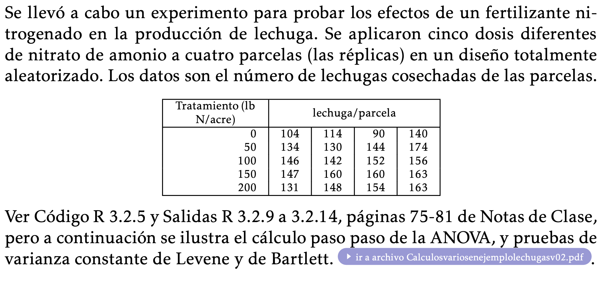

```{r setup, include=FALSE}
knitr::opts_chunk$set(echo = TRUE)
```

```{r pressure, echo=FALSE, out.width = '100%'}

```

```{r warning=FALSE,message=FALSE}
#PROGRAMA R EJEMPLO LECHUGAS 
library(gmodels) 
library(multcomp) 
library(daewr)
library(car)
library(outliers)
#CREANDO FUNCION USUARIO 
library(gmodels)
library(multcomp)
#CREANDO FUNCI ́ON USUARIO mismediastratamientos() 
mismediastratamientos= function(modeloanova,nivel=95){ 
MSE=anova(modeloanova)["Mean Sq"][2,] 
df=anova(modeloanova)["Df"][2,] 
ni=unlist(model.tables(modeloanova,type = "means")["n"]) 
alfa=1-nivel/100
alfa.med=(1-(nivel/100))/2
t=qt(alfa.med,df=df,lower.tail=F) 
medias.tratam=unlist(model.tables(modeloanova,type = "means")["tables"])[-1] 
interval=cbind(ni=ni,Medias=medias.tratam,LIC=medias.tratam-t*sqrt(MSE/ni),
               LSC=medias.tratam+t*sqrt(MSE/ni))
cat("Tabla de medias de tratamientos y sus I.C de",nivel,"%","\n") 
cat("alfa"," ",alfa,"\n")
cat("grados de libertad ",df,"\n")
cat("error cuadra ́tico medio",MSE,"\n")
cat("valor crı ́tico t ",t,"\n","\n")
interval
}

```

```{r}
ni=rep(4,5) #No. re ́plicas por nivel
#obseve que los renglones de datos corresponden a cada nivel desde 0 a 200, respectivamente 
diseno2=data.frame(nitrato=factor(rep(c(0,50,100,150,200),times=ni)),
                   nlechug=c(104,114,90,140,
                             134,130,144,174,
                             146,142,152,156,
                             147,160,160,163,
                             131,148,154,163))

attach(diseno2)
#CALCULANDO MEDIAS DE TRATAMIENTO PARA LUEGO USAR EN GR ́AFICA 
mediasy2=sapply(split(nlechug,nitrato),mean) 
```


```{r}
#BOXPLOTS COMPARATIVOS 
boxplot(nlechug~nitrato,boxwex = 0.5) 
lines(1:5,mediasy2,col=2,lty=2,type="b",pch=19)
#AJUSTE MODELO DE ANALISIS DE VARIANZA 
modelo2=aov(nlechug~nitrato) 
#OBTENIENDO TABLA ANOVA 
anova(modelo2)
#OBTENIENDO MEDIAS ESTIMADAS POR NIVEL DEL FACTOR 
model.tables(modelo2,type = "means",se=TRUE) 
#OBTENCION DE MEDIAS DE TRATAMIENTO CON SUS I.C DEL 95% 
mismediastratamientos(modelo2)
#ESTIMACION DE LOS EFECTOS PRINCIPALES 
model.tables(modelo2,type = "effects",se=TRUE)
#CALCULO INDIVIDUAL DE EFECTOS, SUS TESTES T Y I.C DEL 95% 

```

```{r}
efect.0=fit.contrast(modelo2,"nitrato",rbind(":efecto 0"=c(4/5,-1/5,-1/5,-1/5,-1/5)),conf=0.95) 
efect.50=fit.contrast(modelo2,"nitrato",
rbind(":efecto 50"=c(-1/5,4/5,-1/5,-1/5,-1/5)),conf=0.95)
efect.100=fit.contrast(modelo2,"nitrato",
rbind(":efecto 100"=c(-1/5,-1/5,4/5,-1/5,-1/5)),conf=0.95)
efect.150=fit.contrast(modelo2,"nitrato",
rbind(":efecto 150"=c(-1/5,-1/5,-1/5,4/5,-1/5)),conf=0.95)
efect.200=fit.contrast(modelo2,"nitrato",
rbind(":efecto 200"=c(-1/5,-1/5,-1/5,-1/5,4/5)),conf=0.95)
rbind(efect.0,efect.50,efect.100,efect.150,efect.200)
```

```{r}
#OTRA FORMA PARA C ́ALCULO INDIVIDUAL DE EFECTOS CON SUS INTERVALOS DE CONFIANZA DEL 95%: 
contr0=rbind("efecto nitrato 0"= c(4/5,-1/5,-1/5,-1/5,-1/5))
contr50=rbind("efecto nitrato 50"= c(-1/5,4/5,-1/5,-1/5,-1/5))
contr100=rbind("efecto nitrato 100"= c(-1/5,-1/5,4/5,-1/5,-1/5)) 
contr150=rbind("efecto nitrato 150"= c(-1/5,-1/5,-1/5,4/5,-1/5)) 
contr200=rbind("efecto nitrato 200"= c(-1/5,-1/5,-1/5,-1/5,4/5))
rbind(confint(glht(modelo2,linfct=mcp(nitrato=contr0)))$confint, confint(glht(modelo2,linfct=mcp(nitrato=contr50)))$confint, confint(glht(modelo2,linfct=mcp(nitrato=contr100)))$confint, confint(glht(modelo2,linfct=mcp(nitrato=contr150)))$confint, confint(glht(modelo2,linfct=mcp(nitrato=contr200)))$confint)
```

```{r}
#OBTENIENDO GR ́AFICOS DE RESIDUOS INTERNAMENTE ESTUDENTIZADOS,
layout(rbind(c(1,1,2,2),c(0,3,3,0))) 
stripchart(rstandard(modelo2)~nitrato,vertical=TRUE,ylim=c(-2.5,2.5),pch=1,cex=1,xlab="Lb N/acre") 
abline(h=c(-2,0,2),lty=2)
plot(fitted(modelo2),rstandard(modelo2),ylim=c(-2.5,2.5))
abline(h=c(-2,0,2),lty=2)
qqnorm(rstandard(modelo2)) 
qqline(rstandard(modelo2),lty=2)
#TEST DE NORMALIDAD CON RESIDUOS INTERNAMENTE ESTUDENTIZADOS
shapiro.test(rstandard(modelo2))
#TESTES PARA HOMOGENEIDAD DE VARIANZA 
bartlett.test(nlechug~nitrato)
leveneTest(nlechug~nitrato) 
cochran.test(nlechug~nitrato,data=diseno2) 
detach(diseno2)
```

